# Image Colorization with Deep Learning

A PyTorch implementation of automatic image colorization using deep convolutional neural networks. This project implements the "Let There Be Color!" architecture that learns to colorize grayscale images using both low-level and global semantic features.

## Overview

The model takes grayscale images (L channel in LAB color space) as input and predicts the corresponding color channels (ab channels). It uses a multi-branch architecture that combines:

- Low-level features for texture and local patterns
- Mid-level features for regional structure
- Global features for semantic understanding
- Classification network trained on scene categories

## Results

The model shows different performance depending on the type of scene:

Images of buildings and natural environments preserve color information well, though with a slight lack of saturation and somewhat washed-out colors. The model successfully identifies the semantic content and applies appropriate color palettes for architectural and natural scenes.

| Original Image                  | Colorized Result                           |
| ------------------------------- | ------------------------------------------ |
| 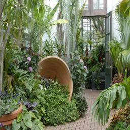 |  |
| 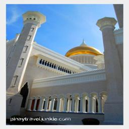 |  |
| 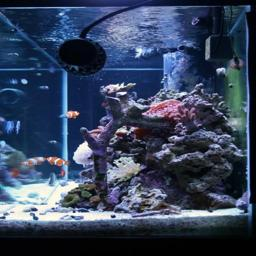 | 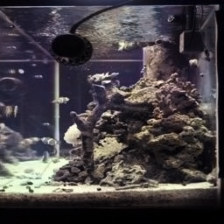 |
|  | 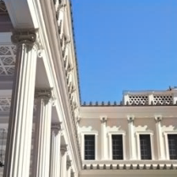 |
| 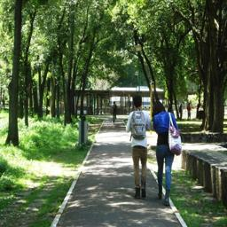 | 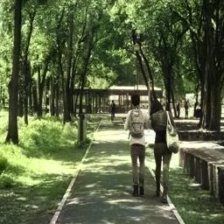 |

Images that include colorful elements or objects with varied colors do not perform as well. As stated in the original paper, the model tends to produce more conservative colorizations when faced with highly variable or vibrant color possibilities, often defaulting to more muted tones to avoid unrealistic results.

| Original Image                  | Colorized Result                           |
| ------------------------------- | ------------------------------------------ |
| 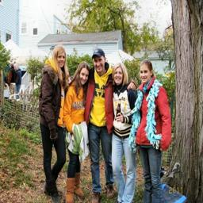 | 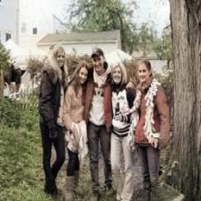 |
|  |  |

This behavior aligns with the known limitations of automatic colorization systems, which must balance between plausible and vivid colorizations, particularly for objects that can have multiple valid color interpretations.

## Model Architecture

The network consists of several components:

1. **Low-Level Features Network**: Extracts basic features (edges, textures)
1. **Mid-Level Features Network**: Processes regional features
1. **Global Features Network**: Captures semantic information
1. **Classification Network**: Predicts scene categories (auxiliary task)
1. **Fusion Layer**: Combines mid-level and global features
1. **Colorization Network**: Generates final color predictions

Input: Grayscale image (L channel, 1×224×224)
Output: Color channels (ab channels, 2×224×224)

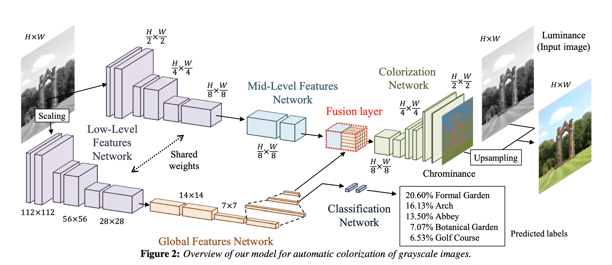

## Installation

This project uses [uv](https://github.com/astral-sh/uv) for fast dependency management.

The dependencies will be automatically installed when you run the training script with `uv run`.

### Dependencies

- Python >= 3.12
- PyTorch >= 2.8.0
- torchvision >= 0.23.0
- kornia >= 0.8.1
- numpy >= 2.3.2
- scikit-image >= 0.25.2
- tqdm >= 4.67.1
- wandb >= 0.21.3 (optional, for experiment tracking)

## Dataset Preparation

This implementation uses the Places365-Standard dataset. You can download and prepare it using the provided Makefile:

```bash
# Download the dataset (this will take a while - ~25GB)
make download_dataset

# Extract the dataset
make extract_dataset

# Create dataset splits (places10, places10_small, places365_small subsets)
make split_dataset

# Or run all steps at once:
make dataset
```

The dataset will be organized in the following structure:

```
data/
  places365_standard/
    train/
      class1/
      class2/
      ...
    val/
      class1/
      class2/
      ...
```

### Dataset Subsets

The `split_dataset` target creates several convenient subsets:

- **places10**: First 10 classes, full dataset
- **places10_small**: First 10 classes, 1000 images per class
- **places365_small**: All 365 classes, 1000 images per class

## Training

### Quick Training with Makefile

The easiest way to start training is using the provided Makefile targets:

```bash
# Train on full Places365 dataset (default)
make train

# Or use specific targets:
make train_places365        # Full Places365 dataset (365 classes, 15 epochs)
make train_places365_small  # Places365 small subset (365 classes, 15 epochs)
make train_places10         # Places10 dataset (10 classes, 15 epochs)
make train_places10_small   # Places10 small subset (10 classes, 15 epochs)
```

Running the full Places365 dataset training takes ~30h on a single RTX3070, and less than 20h on a RTX3090. All the training can be done with `batch_size` 128 (following the paper) in under 8GB VRAM.

The default hyperparameters work well for training:

- Optimizer: Adam
- Learning rate: 1e-4
- Number of epochs: 10-20

I switched to using Adam as the default optimizer since it performed way better than the original paper's Adadelta optimizer. You can still use Adadelta if you want - just pass it as a command line parameter.

Training metrics:
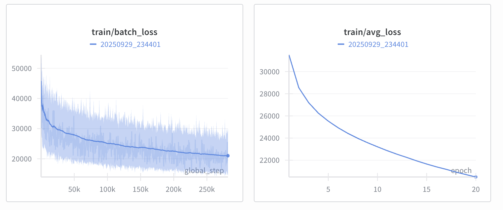

Validation metrics:
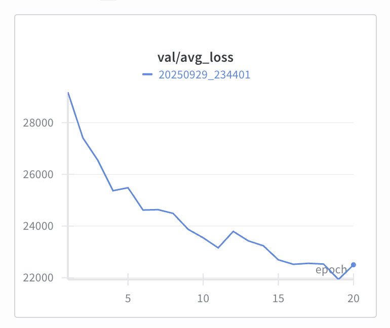

### Manual Training

Train on the full Places365-Standard dataset:

```bash
uv run train.py \
  --device auto \
  --batch-size 128 \
  --epochs 10 \
  --train-data-path ./data/places365_standard/train \
  --val-data-path ./data/places365_standard/val \
  --num-classes 365
```

### Training with Weights & Biases Logging

```bash
uv run train.py \
  --device auto \
  --batch-size 128 \
  --epochs 10 \
  --train-data-path ./data/places365_standard/train \
  --val-data-path ./data/places365_standard/val \
  --num-classes 365 \
  --wandb-log \
  --wandb-project colorizer
```

### Training with torch.compile (Faster Training)

```bash
uv run train.py \
  --device auto \
  --batch-size 128 \
  --epochs 10 \
  --train-data-path ./data/places365_standard/train \
  --val-data-path ./data/places365_standard/val \
  --num-classes 365 \
  --wandb-log \
  --compile
```

### Full Training Example with All Options

Here's a comprehensive example with all available training options:

```bash
uv run train.py \
  --device auto \
  --optimizer adam \
  --learning-rate 1e-4 \
  --num-classes 365 \
  --batch-size 128 \
  --val-batch-size 128 \
  --epochs 15 \
  --train-data-path ./data/places365_standard/train \
  --val-data-path ./data/places365_standard/val \
  --output-dir ./runs \
  --checkpoint-interval 1 \
  --compile \
  --wandb-log \
  --wandb-project colorizer \
  --run-name my_experiment \
  --seed 42
```

### Quick Start with Small Dataset

For quick testing with the smaller dataset subset:

```bash
uv run train.py \
  --device auto \
  --batch-size 64 \
  --epochs 10 \
  --train-data-path ./data/places10_small/train \
  --val-data-path ./data/places10_small/val \
  --num-classes 10
```

### Training Options

| Argument                   | Description                                    | Default                           |
| -------------------------- | ---------------------------------------------- | --------------------------------- |
| `--device`                 | Computing device: `auto`, `cpu`, `cuda`, `mps` | `auto`                            |
| `--epochs`                 | Number of training epochs                      | `10`                              |
| `--batch-size`             | Training batch size                            | `128`                             |
| `--val-batch-size`         | Validation batch size                          | `128`                             |
| `--num-classes`            | Number of scene classes                        | `365`                             |
| `--train-data-path`        | Path to training data                          | `./data/places365_standard/train` |
| `--val-data-path`          | Path to validation data                        | `./data/places365_standard/val`   |
| `--optimizer`              | Optimizer: `adam`, `adamw`, `sgd`, `adadelta`  | `adam`                            |
| `--learning-rate`          | Learning rate                                  | `1e-4`                            |
| `--output-dir`             | Output directory for checkpoints               | `./runs`                          |
| `--checkpoint-interval`    | Save checkpoint every N epochs                 | `1`                               |
| `--compile`                | Use torch.compile for faster training          | `False`                           |
| `--wandb-log`              | Enable Weights & Biases logging                | `False`                           |
| `--wandb-project`          | W&B project name                               | `colorizer2`                      |
| `--run-name`               | Custom run name for logging                    | timestamp                         |
| `--resume-from-checkpoint` | Resume training from checkpoint path           | `None`                            |
| `--seed`                   | Random seed for reproducibility                | `42`                              |

### Resuming Training

To resume training from a checkpoint:

```bash
uv run train.py \
  --resume-from-checkpoint ./path/to/checkpoint_full.pth \
  --device cuda \
  --batch-size 128 \
  --epochs 20
```

## Inference

### Colorize Images

Colorize a single image using a trained model:

```bash
uv run colorize_image.py \
  --weights path/to/final_model.pth \
  --image path/to/input_image.jpg \
  --out path/to/output_colorized.png \
  --device cuda
```

If `--out` is not specified, the output will be saved as `<input_name>_colorized.png` in the same directory as the input.

#### Image Inference Options

| Argument    | Description                            | Default                 |
| ----------- | -------------------------------------- | ----------------------- |
| `--weights` | Path to model weights (.pth file)      | Required                |
| `--image`   | Path to input image                    | Required                |
| `--out`     | Output path for colorized image        | `<input>_colorized.png` |
| `--device`  | Computing device: `cpu`, `cuda`, `mps` | `cpu`                   |

### Colorize Videos

Colorize a video file using a trained model:

```bash
uv run colorize_video.py \
  --weights path/to/final_model.pth \
  --video path/to/input_video.mp4 \
  --out path/to/output_colorized.mp4 \
  --device cuda
```

The script will extract all frames from the input video, colorize each frame using the trained model and construct the video with colorized frames

If `--out` is not specified, the output will be saved as `<video_name>_colorized.mp4` in the same directory as the input.

#### Video Inference Options

| Argument        | Description                               | Default                 |
| --------------- | ----------------------------------------- | ----------------------- |
| `--weights`     | Path to model weights (.pth file)         | Required                |
| `--video`       | Path to input video (mp4, avi, mov, etc.) | Required                |
| `--out`         | Output path for colorized video           | `<video>_colorized.mp4` |
| `--device`      | Computing device: `cpu`, `cuda`, `mps`    | `cpu`                   |
| `--keep-frames` | Keep extracted and colorized frames       | `False`                 |

**Note:** Video colorization requires `ffmpeg` and `ffprobe` to be installed on your system.

On most Debian-based distributions:

```bash
sudo apt install ffmpeg
```

On MacOS:

```zsh
brew install ffmpeg
```

## Checkpoints

During training, checkpoints are saved to `./runs/<timestamp>/`:

- `checkpoint_N.pth`: Model weights only (for inference)
- `checkpoint_N_full.pth`: Full training state (for resuming)
- `final_model.pth`: Final model weights
- `final_model_full.pth`: Final training state

## References

This implementation is based on the paper:

**Let there be Color!: Joint End-to-end Learning of Global and Local Image Priors for Automatic Image Colorization with Simultaneous Classification**
Satoshi Iizuka, Edgar Simo-Serra, and Hiroshi Ishikawa
ACM Transaction on Graphics (Proc. of SIGGRAPH), 35(4):110, 2016

- [Project Page](https://iizuka.cs.tsukuba.ac.jp/projects/colorization/en/)
- Paper: "Let there be Color!: Joint End-to-end Learning of Global and Local Image Priors for Automatic Image Colorization with Simultaneous Classification"
